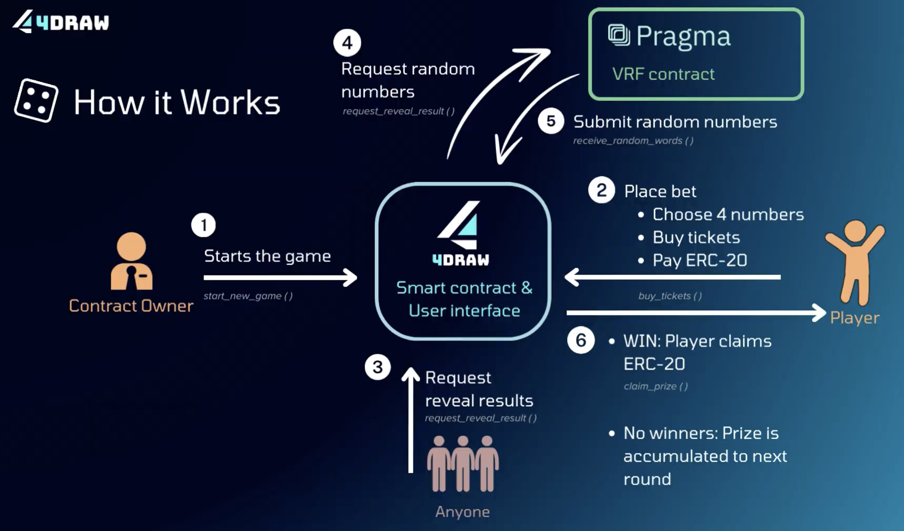

# 4Draw

4Draw is a decentralized lottery game featuring a smart contract for transparent operations, a user-friendly UI for ticket purchases and prize claims, and integration with Pragma’s VRF contract to ensure fairness.

[Demo](https://draw-49019.web.app/)



## How to Play

1. Selecting Numbers:
    - Players need to select 4 numbers from 0 to 9.
    - Numbers can be repeated.
2. Choosing Bet Types:
    - Straight
    - Box
    - Set (Straight/Box)
    - Mini
3. Prize Rule:
    - If there are winners, winners share the accumulated total amount of money spent on purchasing this type of lottery ticket.
    - If there is no winner, the prize will roll over to the next game.

### Straight

- The selected 4-digit number must match the drawn 4-digit number in exact order.

### Box

- The selected 4-digit number must match the drawn 4-digit number in any order.
- The odds of winning vary depending on whether the numbers chosen are unique or repeated.

### Set (Straight/Box)

- A combination of both Straight and Box bets. Players have the chance to win either or both types of prizes.

### Mini

- The last 3 digits of the selected 4-digit number must match the last 3 digits of the drawn number.

## Smart Contract

### Installation

[Scarb - 2.6.5](https://docs.swmansion.com/scarb/download.html)

[Starknet Foundry - 0.25.0](https://foundry-rs.github.io/starknet-foundry/getting-started/installation.html)

### Used External Dependencies

[OpenZeppelin - v0.13.0](https://docs.openzeppelin.com/contracts-cairo/0.13.0/)

[Alexandria - commit: 3041887](https://github.com/keep-starknet-strange/alexandria?tab=readme-ov-file)

[Pragma VRF](https://docs.pragma.build/Resources/Cairo%201/randomness/randomness)

### Compile Contracts

```bash
scarb build
```

### Run Tests

```bash
snforge test
```

### Project Structure

```bash
├── README.md
├── Scarb.lock
├── Scarb.toml
├── frontend
├── src
│   ├── four_draw.cairo
│   ├── lib.cairo
│   ├── randomness.cairo
│   └── ticket_payment_token.cairo
└── tests
    ├── test_four_draw.cairo
    └── utils.cairo
```

### Project Briefs

#### four_draw

- Description: core game logic, manages the game state, maintains accounting, and allows users to interact with it.

- Declared class hash

```bash
Starknet Sepolia
0x07930b491ce13d96b27081fe82d1f492e72b781bb985a20febac9cb4e87488f0
```

- Deployed contract address

```bash
Starknet Sepolia
0x06cfc5dbe6d07ebcb756bdb15055bb067ff2406eef770494204113dccd0adb01
```

#### ticket_payment_token

- Description: test ticket payment token, used in the `FourDraw` contract for buying tickets, and mintable for everyone.

- Declared class hash

```bash
Starknet Sepolia
0x04d858a88381cdd8f446f5eede67fc5840db7d2ee0f296a40179008340161f21
```

- Deployed contract address

```bash
Starknet Sepolia
0x056b0f0bef204a1010663f7fd26c7e0ae56e6491435f6466a36ec6a68c176040
```

#### randomness

- Description: mock VRF contract, which enables us to simulate the behavior of the VRF contract and manipulate randomness for testing purposes.

#### test_four_draw

- Description: comprehensive tests for the FourDraw contract to ensure all functionalities work as expected.

#### utils

- Description: some useful functions for `test_four_draw`.

## Frontend

### How to Start

```bash
git clone https://github.com/VensonLiou/4draw.git

cd frontend

yarn install

yarn dev
```

## How to run production

```bash
yarn build

npx serve@latest out
```

### How to update (subtree)

```bash
git subtree pull --prefix=frontend <path-to-frontend-repo> main
```
